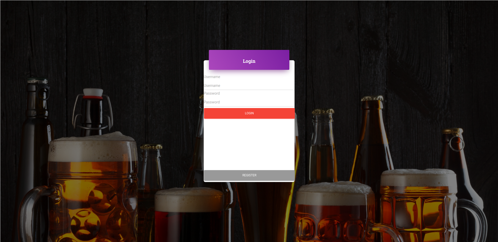
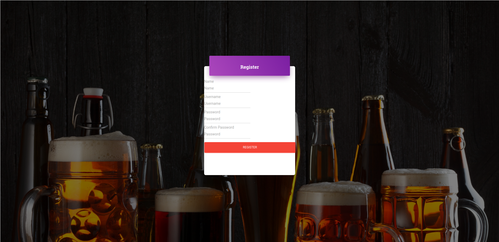
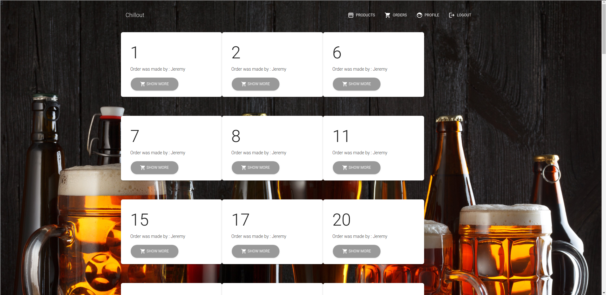
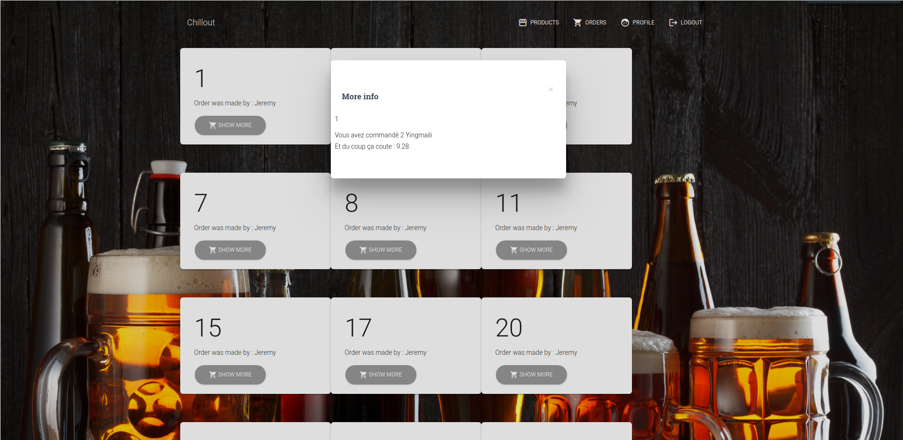
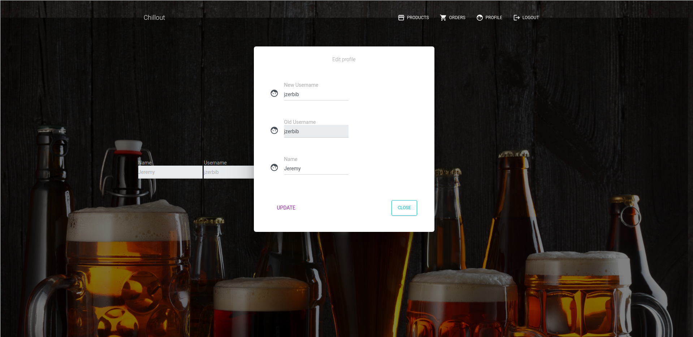

# Jeremy Zerbib, Adam Zouari
# Projet 1 d'AMT

## Explication de l'application
Lors du cours d'`ÀMT`, nous avons dû développer une application multi-tiers.
Pour ce faire, nous avons essayé de modéliser un bar fictif : le **Chillout**.
(Toute ressemblance avec un endroit existant est fortui).  
Pour lancer l'application, il faut suivre les instructions suivantes : 


## Déploiement de l'architecture
Voici les instructions pour déployer le projet à l'aide de `docker-compose`
- Cloner le repo dans votre dossier préféré
- Avant de lancer le script mentionné ci-dessous, il faut être sûr que `Maven`, `docker` et `docker-compose` sont installés
- Lancer `start.sh` avec le paramètre `dev` ou `prod`. 
    - `dev` pour lancer le `docker` sans déployer un `.war`, ce qui pose problème lors du lancement des tests `Arquillian`
    - `prod` pour déployer le `.war` 

Suite au lancement du script, un million de `Products` vont être générés.
Il faut dont être un peu patient et attendre plus ou moins une minute pour que les données soient mises sur la base de données et atteignables.  

Une fois l'application déployée, nous obtenons 3 containers `docker` : 
 - [`payara`](docker/images/payara/Dockerfile) (version avec le `.war``deployée)
 - [`mysql`](docker/images/mysql/Dockerfile)
 - `php-myadmin` (directement dans le [`docker-compose.yml`](/docker/topologies/chillout-prod/docker-compose.yml)) (avec le `.war` déployé)

### payara: serveur d'application
- L'application se trouve à l'adresse `localhost:8080/projectone`
- La console d'administration est accessible à l'adresse `localhost:4848` avec le couple `login:password` "*admin:admin*"

#### Payara en mode debug
Il est possible de lancer l'application en mode `debug` en écoutant le port *9009* sur l'IDE de votre choix **(testé sur IntelliJ)**.  

Le debug se lance lorsque vous appuyez sur l'icône de *Debug* et que vous lancez l'application normalement. 
L'application se bloque lorsque vous atteignez le *breakpoint* souhaité.

### db: serveur MySQL
Dans le `Dockerfile`, nous voulons prendre les données du sous-dossier [`data`](docker/images/mysql/data) et le copier dans le répértoire */docker-entrypoint-initdb.d*

Le mot-de-passe de l'utilisateur `root` est `root`

### php-myadmin: interface de gestion de la base de données
En allant sur le port `6060`, nous pouvons trouver une instance de `php-myAdmin` qui permet de gérer les données générées au préalable.

## Utilisation de notre site Web
Deux utilisateurs sont déjà créés au lancement du projet

| Nom d'utilisateur   | Mot-de-passe |
|---------------------|--------------|
| azouari             | azouari     |
| jzerbib             | jzerbib     |


## Description fonctionnelle
Notre application est composée de 6 pages : 

### Login (Page d'accueil)


Cette page  permet d'accéder au reste de l'application.
Tout le site n'est pas atteignable si l'utilisateur n'est pas validé.
Seule une paire *login:password* permet l'accès au site.  

Si une mauvaise paire est envoyée, alors l'utilisateur est renvoyé vers la même page.
L'application renvoie les messages d'erreurs voulus.

### Register


Sur cette page, l'utilisateur peut se créer un compte qui n'est pas `administrateur`.  

Si un des champs n'est pas valide, par exemple, si un champ est vide, alors le formulaire se vide et la page se recharge avec les messages d'erreurs.

### "Home"


Cette page sert d'accueil à tout utilisateur identifié.
Depuis cette page, l'utilisateur peut aller sur les pages de son choix.

### Products


Nous pouvons voir la liste des bières disponibles sur cette page (Noms de ville mais l'idée est là).
Nous avons choisi une image stock pour montrer que l'image n'est pas disponible et nous affichons une description "*précise*" et personnelle à chaque bière.
(Vous comprenez bien que nous n'avions pas le temps de prendre autre chose que des Lorem Ipsum).

### Orders

Lorsque nous arrivons sur cette page, nous pouvons voir toutes les commandes faites par l'utilisateur.


Lorsque l'utilisateur clique sur "*Show more*", nous voyons le détail de la commande.

### Profile


Sur cette page, l'utilisateur peut consulter certaines informations de son profil et les modifier.


L'édition de profile ressemble à ça.

## Tests

Par manque de temps, nous avons dû effecuter des tests très simpliste.

### JUnit

Pour nos modèles, nous avons écrit des test JUnit. 
Ici nous testons le modèle `Product` :

```
@Test
    void itShouldBePossibleToCreateProduct(){
        Product product = Product.builder()
                .id(2)
                .name("Boxer")
                .unitPrice(2.00)
                .description("Bière Romande par excellence.")
                .build();
        assertEquals("Boxer", product.getName());
        assertEquals(2.00, product.getUnitPrice());

    }

```
### Mockito

Dans le cas des Servlets, nous avons effectuer des test Mockito. 
Nous avons eu beaucoup de difficultés à comprendre le fonctionnement de ces test et c'est la raison pour laquelle vous trouverez des classes de tests vides et d'autres commentées. Ici nous testons le `LogoutServlet` :


```
  @Test
    public void doGet() throws ServletException, IOException {
        servlet.doGet(request, response);
        verify(session, atLeastOnce()).invalidate();
        verify(response, atLeastOnce()).sendRedirect(request.getContextPath() + "/login");
    }
```

### Arquillian

Enfin pour nos DAO nous avons ecrit des tests Arquillian. Ici nous testons notre `ProductManager` :
```

@Test
    @Transactional(TransactionMode.ROLLBACK)
    public void itShouldBePossibleToCreateProduct() throws DuplicateKeyException {
        Product boxer = Product.builder().name("boxer").unitPrice(2.00).description("Bière Romande par excellence.").build();
        productsManagerLocal.create(boxer);
    }

```


## Liste des bugs connus
- Path transveral, une fois l'user connecté il est possible de changer l'id pour se faire passer pour un autre user.
- Mots de passes stockées en clair

